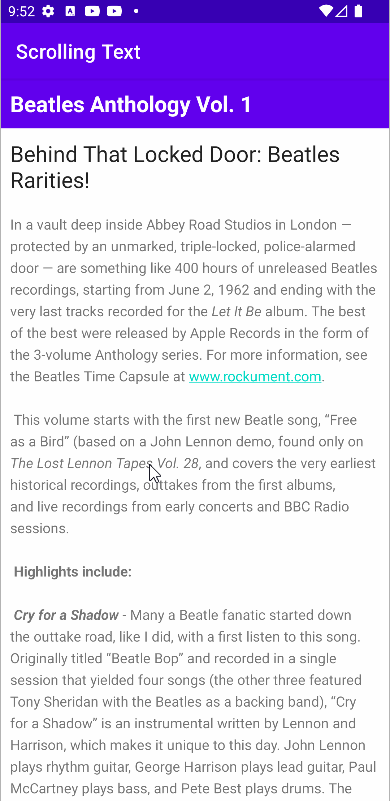
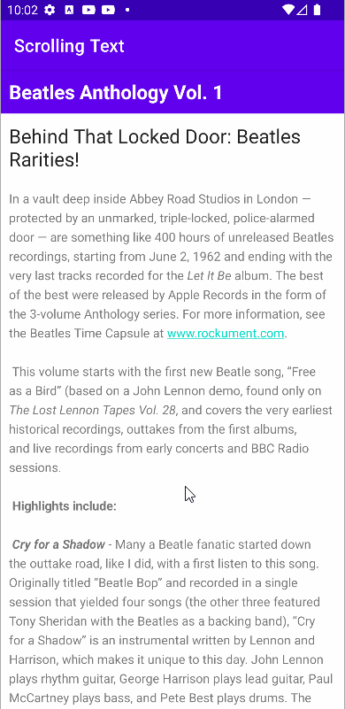
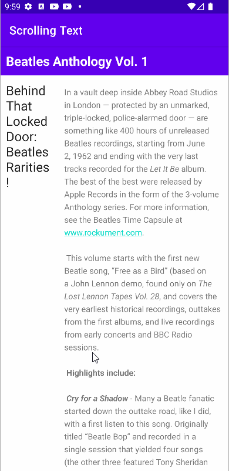

# Text-and-scrolling-views
text scroll tasks

challenges 

homework 
 

<b>Question 1</b> 

How many views can you use within a ScrollView?  
-> One view or one view group

<b>Question 2</b> 

Which XML attribute do you use in a LinearLayout to show views side by side?  
  -> android:orientation="horizontal"
  

  
<b>Question 3</b> 

Which XML attribute do you use to define the width of the LinearLayout inside the scrolling view? 
-> android:layout_width="match_parent"

